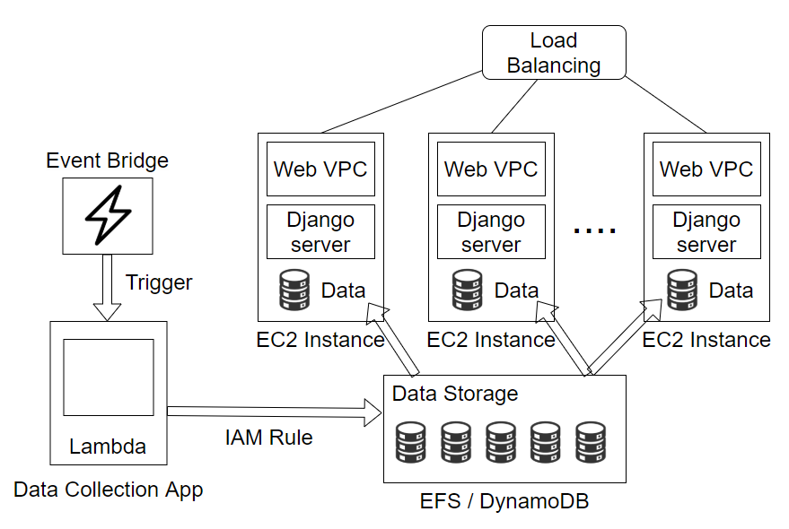
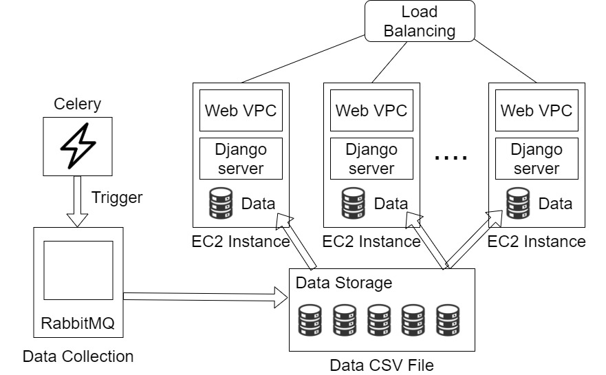

# 멀티미디어컴퓨팅 수업 프로젝트 진행중
- 강성우 김동준 노윤아 이준석 정원용
- Korea University

# 서버 모식도  

  

# 비동기 작업 실행 방법

설치 모듈 : celery 5.2.7
설치 프로그램 : Erlang 25.0, RabbitMQ 3.10.5

1. RabbitMQ Service - Start를 눌러 비동기 작업 broker(분배기)를 실행한다.
2. RabbitMQ Command Prompt를 실행시킨다.
3. 'rabbitmq-plugins.bat enable rabbitmq_management' 를 입력하여 관리 대시보드를 작동시킨다. 이렇게 하면 비동기 작업 입력 상황을 'http://localhost:15672/' 창에서 확인할 수 있다. (아이디:guest, 비번:guest)
4. cmd 창 두개를 띄운다.
5. cmd 창 경로가 '~\stock-predict-django\webapp'인지 확인한다. 아닐 경우 'cd webapp'을 입력하거나 하여 경로를 맞춰준다.
6. 한쪽 창에 'celery -A webapp worker -l info --pool=threads'를 입력하여 RabbitMQ 비동기 작업 큐에 연결한다.
7. 다른 창에 'celery -A webapp beat -l info'를 입력하여 반복작업을 큐에 입력한다.
8. 반복 작업을 추가하고 싶다면?
   - 반복하고자 하는 함수가 있는 파일에 'from celery import shared_task' 코드를 통해 shared_task를 불러오고, 반복하고자 하는 함수에 @shared_task 데코레이터를 붙여주면 자동으로 함수가 인식되어 비동기 큐에 추가가 된다. @shared_task(name = "~~~~" ) 식으로 이름 지정도 가능하다.
   - 반복작업 설정은 ~\webapp\celery.py의 app.conf.beat_schedule에서 변경한다.
   - task : 애플리케이션명.파일명.함수명 또는 위에서 지정함 name으로 지정가능하다.
   - schedule : 반복시간, 자세한건 crontab이나 django celery periodic task 설정 방법을 검색해보고 변경하면 된다!! https://lucky516.tistory.com/18
   - args : 함수에 변수를 입력할 필요가 있을 경우 넣어준다.
9.  웹사이트 실행은 기존처럼 새로운 cmd 창에 runserver 명령을 통해서 실행한다.
10. 충돌 없이 파일 업데이트 작업과 웹사이트 수행이 이루어짐을 확인한다.

# 참고 사이트 : 
## 설치:
- https://oingdaddy.tistory.com/165
- 맥북 : https://simpleisbetterthancomplex.com/tutorial/2017/08/20/how-to-use-celery-with-django.html
  
## 비동기 작업 :
- https://nickmccullum.com/celery-django-periodic-tasks/
- https://velog.io/@yvvyoon/celery-first-step-1
- https://velog.io/@khh180cm/celery-RabbitMQ-2
- https://docs.celeryq.dev/en/stable/django/first-steps-with-django.html
- https://docs.celeryq.dev/en/latest/userguide/tasks.html#task-naming-relative-imports
- https://docs.celeryq.dev/en/stable/reference/celery.html#celery.Celery.add_periodic_task
- https://devlog.jwgo.kr/2019/07/02/using-celery-with-django-2/
- https://lucky516.tistory.com/18
- https://kimdoky.github.io/tech/2019/01/23/celery-rabbitmq-tuto/
## 참고 단어 : celery, rabbitmq, django-beat

